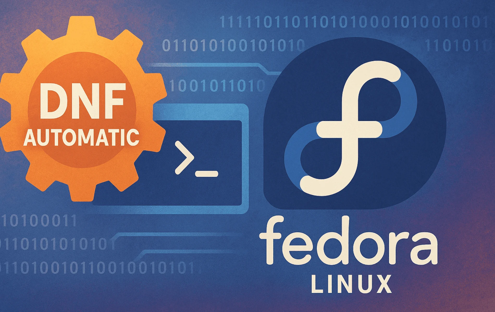

# DNF Auto-Downloader for Fedora



A robust `systemd` architecture that automates background **DNF upgrade downloads**, provides persistent, battery‑safe **user notifications**, and cleanly installs, verifies, and uninstalls itself.

It is built and tested for Fedora with `dnf`/`dnf5`.

## ⚡ Quick Start

```bash
chmod +x DNF-auto.sh
sudo ./DNF-auto.sh install    # installs helper, units, and default config

# Optional: run a health check after install
dnf-auto-helper --verify

# Later, just watch for "Updates ready" notifications and click Install
```

-----

## 🐞 Reporting Issues

**If you need help, please include the relevant logs.** See [Reporting Issues](#reporting-issues) for exact commands.

-----

## 🎯 Goal

On Fedora, updates can be frequent and large. The slow part is usually **downloading** packages, not running `dnf upgrade` itself.

This helper automates the slow part: it runs a background **DNF downloader** on a schedule so that, when you choose to upgrade, most or all packages are already in the cache. A "10‑minute" update becomes roughly "1 minute of authenticated install".

By default it runs a full `dnf update --downloadonly` in the background (configurable), but only after passing several safety checks.

-----

## ✨ Key Features

- **Single entrypoint command:**
  - `dnf-auto-helper` in `/usr/local/bin` (installed by `DNF-auto.sh`).
  - Shell aliases for Bash, Zsh, and Fish so you can just type `dnf-auto-helper`.
  - Common commands/modes: `install`, `--verify` / `--repair` / `--diagnose`, `--check` / `--self-check`, `--reset-config`, `--reset-downloads` / `--reset-state`, `--logs`, `--live-logs`, `--test-notify`, `--soar`, `--brew`, `--pip-package` (alias: `--pipx`), and scripted uninstall modes.

- **Background pre‑download of updates:**
  - Root systemd service + timer:
    - `dnf-autodownload.service`
    - `dnf-autodownload.timer`
  - Runs a controlled `dnf update --downloadonly` pass using settings from `/etc/dnf-auto.conf`.
  - Writes machine‑readable status to `/var/log/dnf-auto/download-status.txt` (e.g. `refreshing`, `downloading:…`, `complete:…`, `idle`).
  - Default behaviour is **`DOWNLOADER_DOWNLOAD_MODE=full`** so packages are cached ahead of time. You can switch to `detect-only` if you only want notifications.

- **User‑space notifier with desktop integration:**
  - User service + timer in `~/.config/systemd/user`:
    - `dnf-notify-user.service`
    - `dnf-notify-user.timer`
  - Python notifier script: `~/.local/bin/dnf-notify-updater.py`.
  - Talks to your desktop session over D‑Bus and shows rich, clickable notifications.
  - Distinguishes laptops vs desktops, AC vs battery, metered vs unmetered connections using `upower`, `inxi`, and `nmcli` and only runs checks when it is safe.

- **Ready‑to‑Install helper:**
  - Clickable "Install" / "Install now" actions open a terminal and run a wrapper script:
    - `~/.local/bin/dnf-run-install`
  - That script drives `pkexec dnf upgrade` interactively, with additional post‑update checks.

- **Optional post‑update helpers:** (controlled via `/etc/dnf-auto.conf`)
  - Flatpak updates.
  - Snap refresh (if Snap is installed).
  - Soar (PkgForge) stable‑version check + `soar sync` + `soar update`.
  - Homebrew: `brew update` and conditional `brew upgrade`.
  - pipx: optional `pipx upgrade-all` so Python CLI tools stay in sync with system updates.

- **Health‑check & auto‑repair:**
  - `dnf-auto-helper --verify` runs a 12‑point check that verifies:
    - Root timers and services are active + enabled.
    - User timers/services exist and are active.
    - Helper scripts exist, are executable, and have valid syntax.
    - Log directories and status files exist.
    - Stale DNF PID locks are cleaned up when safe.
    - Root filesystem free space is sane (with optional `dnf clean all`).
  - Many common problems are auto‑fixed; remaining issues are summarised.
  - A root service + timer (`dnf-auto-verify.service` / `dnf-auto-verify.timer`) can run the same logic periodically.

- **Configuration in `/etc/dnf-auto.conf`:**
  - Timer intervals, log retention, notifier cache/snooze behaviour.
  - Optional helpers on/off flags (Flatpak, Snap, Soar, Homebrew, pipx).
  - Extra DNF solver flags via `DUP_EXTRA_FLAGS` (for both downloader and preview).
  - All values are validated; invalid values fall back to safe defaults and are logged.

- **Scripted uninstaller:**
  - `dnf-auto-helper --uninstall-dnf-helper` (alias: `--uninstall-dnf`) removes all dnf-auto-helper timers, services, helper binaries, user scripts, logs, and caches while leaving DNF itself and Fedora configuration untouched.

- **Extensive logging:**
  - Installation logs and status under `/var/log/dnf-auto/`.
  - Service logs under `/var/log/dnf-auto/service-logs/`.
  - Notifier logs and status under `~/.local/share/dnf-notify/`.
  - Automatic log rotation and pruning.

- **Safety first:**
  - Installer disables common PackageKit background services that would otherwise compete for the DNF lock.
  - Downloader runs at low CPU/IO priority; safety decisions (AC, metered, etc.) are enforced in the notifier.

-----

## 🧱 Architecture Overview

There are three main components: the installer, the root‑level downloader/verification services, and the user‑level notifier.

### 1. Installer: `DNF-auto.sh`

Run once (or whenever you update config) as root:

- Cleans up any older helper installations (including legacy zypper‑auto‑helper units if present).
- Ensures dependencies are installed (e.g. `nmcli`, `upower`, `inxi`, `python3`, `python3-gobject`, `pkexec`, `semanage`).
- Writes systemd units for:
  - `dnf-autodownload.service` / `dnf-autodownload.timer`
  - `dnf-cache-cleanup.service` / `dnf-cache-cleanup.timer`
  - `dnf-auto-verify.service` / `dnf-auto-verify.timer`
- Sets up user units and scripts for the notifier:
  - `~/.config/systemd/user/dnf-notify-user.service` / `.timer`
  - `~/.local/bin/dnf-notify-updater.py`, `dnf-run-install`, `dnf-with-ps`, `dnf-view-changes`.
- Creates the `dnf-auto-helper` CLI in `/usr/local/bin` and shell aliases.
- Loads and validates `/etc/dnf-auto.conf`, writing a documented default file if it is missing.

### 2. Downloader (root service)

- **Service:** `/etc/systemd/system/dnf-autodownload.service`
  - Runs a preview + download pass using DNF (behaviour controlled by `DOWNLOADER_DOWNLOAD_MODE` and `DUP_EXTRA_FLAGS`).
  - Writes status to `/var/log/dnf-auto/download-status.txt`:
    - `refreshing`
    - `downloading:…`
    - `complete:…`
    - `idle`
- **Timer:** `/etc/systemd/system/dnf-autodownload.timer`
  - Interval derived from `DL_TIMER_INTERVAL_MINUTES` in `/etc/dnf-auto.conf`.
  - Allowed values: `1,5,10,15,30,60` minutes.
  - Mapped to simple schedules (`minutely`, `hourly`, or `*:0/N`).

### 3. Verification / Auto‑Repair (root service)

- **Service:** `/etc/systemd/system/dnf-auto-verify.service`
  - Runs the same verification logic that `dnf-auto-helper --verify` uses.
  - Optionally sends a short desktop notification when it fixes issues (controlled by `VERIFY_NOTIFY_USER_ENABLED`).
- **Timer:** `/etc/systemd/system/dnf-auto-verify.timer`
  - Interval from `VERIFY_TIMER_INTERVAL_MINUTES` (same allowed values as above).

### 4. Notifier (user service)

- **Service:** `~/.config/systemd/user/dnf-notify-user.service`
  - Runs `~/.local/bin/dnf-notify-updater.py` under your user.
  - Reads downloader status, re‑checks with a non‑interactive DNF preview, and drives notifications.
- **Timer:** `~/.config/systemd/user/dnf-notify-user.timer`
  - Interval from `NT_TIMER_INTERVAL_MINUTES` in `/etc/dnf-auto.conf`.

Typical flow:

1. Downloader timer fires and pre‑downloads updates using DNF (when `DOWNLOADER_DOWNLOAD_MODE=full`).
2. Notifier timer wakes up, checks the cached status and DNF preview.
3. Once background downloads have completed and there are still pending updates, you see a persistent **"Updates Ready"** notification with buttons like **Install**, **View Changes**, **Snooze 1h/4h/1d**.
4. Clicking **Install** opens a terminal running `dnf-run-install`, which wraps `pkexec dnf upgrade` and post‑update helpers.

-----

## 🚀 Installation / Upgrade

You can run the installer on a fresh Fedora system or over an existing helper installation; it is idempotent.

```bash
chmod +x DNF-auto.sh
sudo ./DNF-auto.sh install
```

The installer will:

- Create/update `/etc/dnf-auto.conf` (if missing, a documented default is written).
- Install or update the `dnf-auto-helper` command.
- Set up root and user systemd units.
- Disable conflicting PackageKit background services.
- Run syntax checks and a verification pass.

After installation, restart your shell or open a new terminal so the `dnf-auto-helper` alias is available.

### Using `dnf-auto-helper`

```bash
dnf-auto-helper --help             # Show help and available commands
dnf-auto-helper install            # Re-run installation / upgrade
dnf-auto-helper --verify           # Full health check + auto-repair
dnf-auto-helper --repair           # Alias for --verify
dnf-auto-helper --diagnose         # Alias for --verify
dnf-auto-helper --check            # Syntax/self-check only
dnf-auto-helper --reset-config     # Reset /etc/dnf-auto.conf to defaults (with backup)
dnf-auto-helper --reset-downloads  # Clear download/notifier state and restart timers (alias: --reset-state)
dnf-auto-helper --logs             # Show recent installer/service/notifier logs
dnf-auto-helper --live-logs        # Follow logs in real time (requires sudo)
dnf-auto-helper --test-notify      # Send a test desktop notification via the notifier unit
dnf-auto-helper --soar             # Optional Soar helper (install/upgrade)
dnf-auto-helper --brew             # Optional Homebrew helper (install/upgrade)
dnf-auto-helper --pip-package      # Optional pipx helper (install/upgrade, alias: --pipx)
dnf-auto-helper --uninstall-dnf-helper  # Remove helper timers/services/scripts/logs (alias: --uninstall-dnf)
```

You normally run `dnf-auto-helper` **without** `sudo`; it uses `pkexec` or root services internally when needed.

-----

## ⚙️ Configuration: `/etc/dnf-auto.conf`

The installer reads `/etc/dnf-auto.conf` on each run. If the file is missing, a documented template is generated.

Some important options (names match what `DNF-auto.sh` expects):

- **Post‑update helpers**
  - `ENABLE_FLATPAK_UPDATES`
  - `ENABLE_SNAP_UPDATES`
  - `ENABLE_SOAR_UPDATES`
  - `ENABLE_BREW_UPDATES`
  - `ENABLE_PIPX_UPDATES`

- **Timer intervals** (minutes; allowed: `1,5,10,15,30,60`)
  - `DL_TIMER_INTERVAL_MINUTES` – downloader timer frequency.
  - `NT_TIMER_INTERVAL_MINUTES` – user notifier frequency.
  - `VERIFY_TIMER_INTERVAL_MINUTES` – health‑check timer frequency.

- **Notifier cache / snooze**
  - `CACHE_EXPIRY_MINUTES` – how long a cached preview is trusted before forcing a new check.
  - `SNOOZE_SHORT_HOURS`, `SNOOZE_MEDIUM_HOURS`, `SNOOZE_LONG_HOURS` – real durations for the 1h / 4h / 1d snooze buttons.

- **Downloader behaviour and DNF flags**
  - `DOWNLOADER_DOWNLOAD_MODE` (case‑sensitive):
    - `full` (default) – run a full `dnf update --downloadonly` and cache packages. The notifier only shows the final "Updates ready" / **Install** notification after a completed background download has been confirmed (or everything was already cached).
    - `detect-only` – only run a non‑interactive preview; no pre‑download. In this mode, notifications can appear as soon as the preview sees pending updates, even if packages are not yet cached.
  - `DUP_EXTRA_FLAGS` – extra flags appended to every DNF call made by the helper
    (both downloader and notifier). Useful for things like `--refresh` or repo
    selection flags.

- **Lock behaviour & reminders**
  - `LOCK_RETRY_MAX_ATTEMPTS`, `LOCK_RETRY_INITIAL_DELAY_SECONDS` – how the Ready‑to‑Install helper retries when the package manager lock is in use.
  - `LOCK_REMINDER_ENABLED` – whether to show a small "updates paused, DNF is in use" notification while another DNF/PackageKit instance holds the lock.
  - `NO_UPDATES_REMINDER_REPEAT_ENABLED` / `UPDATES_READY_REMINDER_REPEAT_ENABLED` – control whether identical "No updates" / "Updates ready" notifications can repeat.
  - `VERIFY_NOTIFY_USER_ENABLED` – whether periodic verification sends a summary notification when it fixes issues.

If values are missing or invalid, `DNF-auto.sh` falls back to safe defaults, logs warnings, and records them in `/var/log/dnf-auto/last-status.txt`. The helper may also suggest `dnf-auto-helper --reset-config`.

-----

## 🏃 Everyday Usage

Once installed you normally **don’t** need to run anything manually:

1. **Wait** – the downloader and notifier timers run in the background (by default every minute; configurable via `/etc/dnf-auto.conf`).
2. **Watch for notifications** – you’ll see a notification only when updates are actually pending.
3. **Click Install** – the **Install** button launches `dnf-run-install` in a terminal, which runs `pkexec dnf upgrade` plus any enabled helpers (Flatpak, Snap, Soar, Homebrew, pipx).

### Quick Status Checks

```bash
# High-level installation/system status
cat /var/log/dnf-auto/last-status.txt

# Notifier status
cat ~/.local/share/dnf-notify/last-run-status.txt

# Raw downloader status file
cat /var/log/dnf-auto/download-status.txt

# Health check + auto-repair
dnf-auto-helper --verify
```

-----

## 📊 Logging & Monitoring

- **System / installer logs:** `/var/log/dnf-auto/`
  - `install-YYYYMMDD-HHMMSS.log` – full log of each installer run.
  - `last-status.txt` – last high‑level status message.
  - `service-logs/*.log` – logs from downloader / verification services.
- **User / notifier logs:** `~/.local/share/dnf-notify/`
  - `notifier-detailed.log` – detailed notifier log.
  - `last-run-status.txt` – last notifier status.

Example commands:

```bash
# Show most recent install log
ls -t /var/log/dnf-auto/install-*.log | head -1 | xargs sudo cat

# Downloader service logs
sudo cat /var/log/dnf-auto/service-logs/downloader.log

# Notifier details
cat ~/.local/share/dnf-notify/notifier-detailed.log
```

Helper shortcuts:

```bash
# One-shot log summary (tails of installer, services, notifier)
dnf-auto-helper --logs

# Live view of all logs (installer, services, notifier); Ctrl+C to exit
sudo dnf-auto-helper --live-logs

# StLogs are automatically rotated and pruned; no manual maintenance is required.

If you need compact, per-day diagnostic traces for debugging, you can also
use the background diagnostics follower (see below) to aggregate logs into
`/var/log/dnf-auto/diagnostics/diag-YYYY-MM-DD.log` with automatic 10‑day
retention.
o-helper --diag-logs-on

# Stop diagnostics follower (if running)
sudo dnf-auto-helper --diag-logs-off
```

Logs are automatically rotated and pruned; no manual maintenance is required.

-----

## 🗑️ Uninstallation

### Scripted uninstaller (recommended)

The helper includes a scripted uninstaller designed to **clean up helper components only** (it never removes DNF itself or Fedora configuration).

```bash
# From the directory containing DNF-auto.sh
sudo ./DNF-auto.sh --uninstall-dnf-helper   # alias: --uninstall-dnf

# Or via the installed CLI
dnf-auto-helper --uninstall-dnf-helper      # alias: --uninstall-dnf
```

Typical effects:

- Stop & disable helper timers/services (`dnf-autodownload`, `dnf-cache-cleanup`, `dnf-auto-verify`, notifier units).
- Remove helper systemd unit files and scripts.
- Remove user helper scripts, aliases, and notifier caches.
- Optionally keep or delete logs under `/var/log/dnf-auto/`.

Advanced flags like `--yes`, `--dry-run`, and `--keep-logs` are supported.

-----

## 📣 Reporting Issues

When filing an issue, please include at least:

```bash
# 1) Most recent installer log
sudo cat $(ls -t /var/log/dnf-auto/install-*.log | head -1)

# 2) Installer status
cat /var/log/dnf-auto/last-status.txt

# 3) Notifier detailed log
cat ~/.local/share/dnf-notify/notifier-detailed.log

# 4) Notifier last run status
cat ~/.local/share/dnf-notify/last-run-status.txt
```

Also mention:

- Your Fedora version: `cat /etc/os-release`
- DNF version: `dnf --version` (and `dnf5 --version` if applicable)
- A short description of what you expected vs what happened.

Please **redact personal data** (usernames, hostnames, network names) from logs before posting.

-----

## 🛠️ Notes for former zypper users

Earlier versions of this project targeted openSUSE and `zypper` with a very similar architecture (background downloader, user‑space notifier, scripted uninstaller, and external config).

The current codebase and this README are now Fedora‑ and DNF‑only:

- Script names are `DNF-auto.sh`, `dnf-auto-helper`, `dnf-notify-updater.py`, `dnf-run-install`, etc.
- Config is `/etc/dnf-auto.conf`.
- Systemd units and log paths all start with `dnf-*` and `/var/log/dnf-auto/`.

If you still have any old `zypper-auto-*` files from earlier experiments, you can remove them manually using your package manager and `systemctl`.

-----

## 👩‍💻 Developer / Contributor Testing

### Notification UI Test Harness (`test.py`)

Located in the repo root, `test.py` exercises the full DNF notification flow
without touching your real systemd units or running actual `dnf upgrade`.

```bash
python3 test.py
```

What it does:

- Simulates the main **happy path** notification stages:
  - "Checking for updates…"
  - "Downloading updates…" with a progress bar
  - "✅ Downloads Complete!" summary
  - A persistent **Updates Ready** notification with **Install**,
    **View Changes**, and **Snooze 1h/4h/1d** buttons.
- Simulates the main **error/edge‑case** notifications:
  - Solver/interaction error ("Updates require your decision") with an
    **Install Now** action.
  - PolicyKit/authentication failure ("Update check failed").
  - Config warning ("DNF Auto-Helper config warnings – run
    `dnf-auto-helper --reset-config`").
  - DNF lock situations with a dedicated lock‑retry test action.
- Uses the same `on_action` callback shape as the real notifier so that
  clicking **Install** attempts to run `~/.local/bin/dnf-run-install` or,
  if missing, falls back to opening `konsole`.

All activity is logged to `test.log` in the repo root (ignored by Git). Each
run is wrapped in clear markers:

```text
================ RUN YYYYMMDD-HHMMSS START ================
...
================ RUN YYYYMMDD-HHMMSS END ==================
```

The log includes:

- Python version and key environment variables (`DISPLAY`, `WAYLAND_DISPLAY`,
  `XDG_SESSION_TYPE`, `USER`, `HOME`, `PWD`).
- For each notification: title, body preview, icon name, timeout, and (when
  relevant) the helper script path that would be launched.
- For each action click: action id, resolved script path, whether it exists and
  is executable, PID of any launched helper/terminal process, and full
  tracebacks for any failures.
